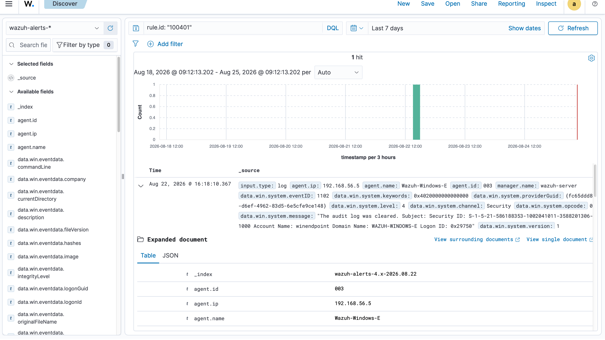
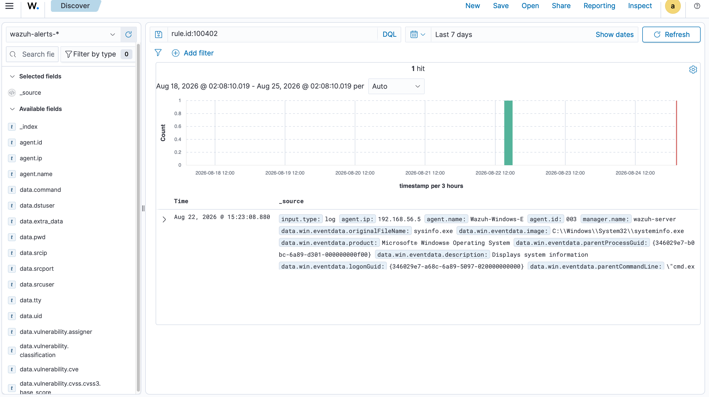
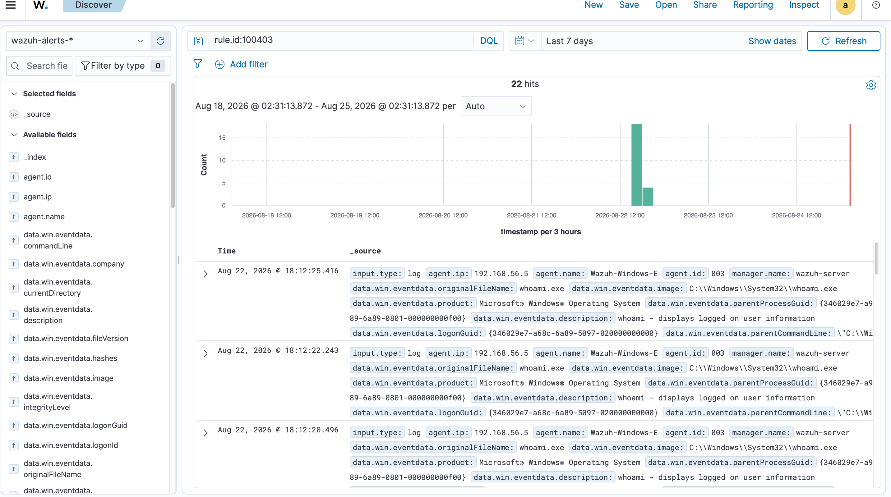
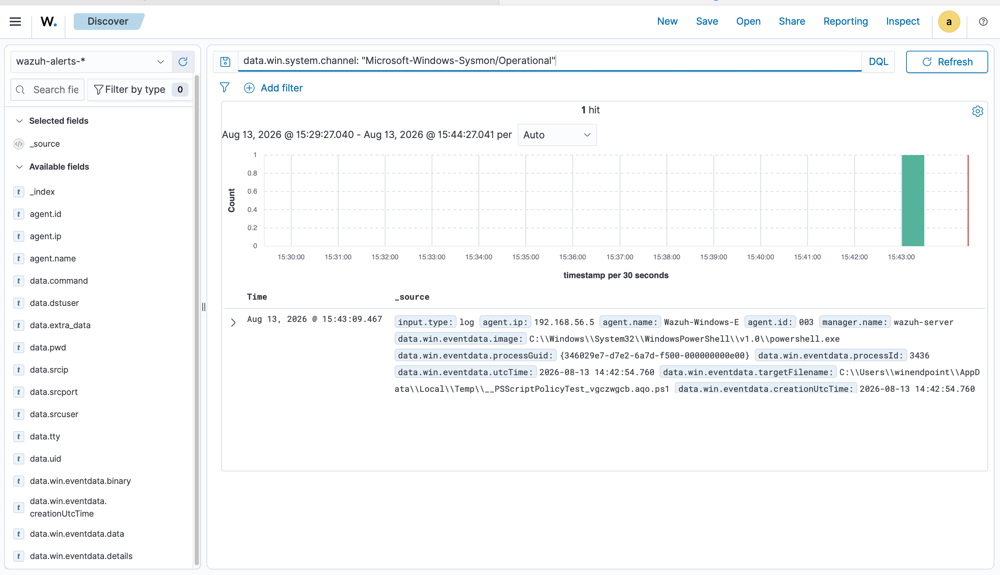

# Detection Engineering & Alert Triage

## SOC Analyst Training — Project 2

> From MITRE ATT&CK technique selection to detection logic, adversary simulation, alert generation, and SOC triage.

---

## 📌 Project Overview

This project demonstrates practical **detection engineering and security alert triage** using **Wazuh 4.14.6**, **Windows endpoint telemetry**, **Sysmon**, and **Atomic Red Team**.

The project builds on an existing SIEM lab and moves beyond passive log collection into active detection engineering.

The primary objective was to map real attacker behaviors to the **MITRE ATT&CK framework**, translate those behaviors into working Wazuh detection rules, safely simulate the techniques, validate the resulting telemetry, and apply a consistent SOC alert-triage workflow.

Six custom Wazuh detection rules were developed across multiple MITRE ATT&CK tactics:

- Persistence
- Defense Evasion
- Discovery
- Credential Access
- Command and Control

Four of the six detection scenarios successfully generated the expected detection telemetry. Two simulations were prevented by Windows Defender before the underlying behaviors could execute.

The project also included a severity-based triage playbook and practice scenarios involving true positives, prevented activity, and false positives.

---

## 🎯 Project Objectives

The project focused on the following objectives:

- Map attacker behaviors to MITRE ATT&CK techniques.
- Translate ATT&CK techniques into Wazuh detection logic.
- Create and test custom Wazuh detection rules.
- Safely simulate adversary behavior using Atomic Red Team.
- Validate detection rules against live endpoint telemetry.
- Investigate security alerts generated by the SIEM.
- Distinguish between true positives, false positives, benign activity, and prevented activity.
- Apply severity-based alert prioritization.
- Define escalation and closure criteria.
- Document alert dispositions using evidence-based reasoning.

---

## 🏗️ Lab Environment

The project was conducted in an isolated virtual lab environment built during the previous SIEM project.

### Environment Components

| Component | Purpose |
|---|---|
| Wazuh Manager | SIEM and detection engine |
| Windows Endpoint | Primary endpoint used for attack simulation |
| Sysmon | Detailed Windows process and endpoint telemetry |
| Windows Event Logs | Security and System event collection |
| Linux Endpoint | Additional log source |
| Simulated Firewall | Additional syslog source |
| Atomic Red Team | Controlled adversary simulation |
| MITRE ATT&CK | Threat behavior and technique mapping |

The project reused the existing lab infrastructure rather than rebuilding the environment.

---

## 🔄 Detection Engineering Workflow

```text
MITRE ATT&CK Technique
          ↓
Detection Logic
          ↓
Wazuh Custom Rule
          ↓
Rule Validation
          ↓
Adversary Simulation
          ↓
Endpoint Telemetry
          ↓
Alert Generation
          ↓
Alert Triage
          ↓
Investigation
          ↓
Classification
          ↓
Escalation / Closure
          ↓
Documentation
```

---

# 🛡️ Detection Rule Portfolio

Six custom Wazuh rules were created in the manager's `local_rules.xml` configuration.

| Rule ID | MITRE ATT&CK Technique | Tactic | Level | Result |
|---|---|---|---:|---|
| **100400** | T1053.005 — Scheduled Task | Persistence | 8 | ✅ Fired |
| **100401** | T1070.001 — Clear Windows Event Logs | Defense Evasion | 12 | ✅ Fired |
| **100402** | T1082 — System Information Discovery | Discovery | 5 | ✅ Fired |
| **100403** | T1033 — System Owner/User Discovery | Discovery | 5 | ✅ Fired |
| **100404** | T1003.001 — OS Credential Dumping: LSASS | Credential Access | 15 | 🛡️ Blocked |
| **100405** | T1105 — Ingress Tool Transfer | Command and Control | 10 | 🛡️ Blocked |

---

# 🔬 Detection Engineering

## Rule 100400 — Scheduled Task

**MITRE ATT&CK:** T1053.005 — Scheduled Task/Job: Scheduled Task

**Tactic:** Persistence

**Wazuh Level:** 8

### Detection Logic

The rule detects `schtasks.exe` being launched with the `/create` argument in the command line.

### Simulation

Atomic Red Team was used to simulate scheduled-task creation.

The test created two scheduled tasks:

- `T1053_005_OnLogon`
- `T1053_005_OnStartup`

Both tasks were configured to launch `cmd.exe` when triggered.

### Result

**Detection Status: Successfully Validated ✅**

The rule fired twice from the test because two scheduled tasks were created.

### Security Significance

Scheduled tasks can be abused by attackers to establish persistence or execute commands automatically.

### Evidence

See:

[`03-detection-engineering/rule-100400.md`](03-detection-engineering/rule-100400.md)

---

# Rule 100401 — Clear Windows Event Logs

**MITRE ATT&CK:** T1070.001 — Clear Windows Event Logs

**Tactic:** Defense Evasion

**Wazuh Level:** 12 — Critical

### Detection Objective

The rule detects the clearing of the Windows Security audit log.

### Detection Logic

The rule triggers when the Windows Security event ID equals:

```text
1102
```

Windows Event ID 1102 indicates that the Security audit log was cleared.

### Simulation

Atomic Red Team did not have a maintained test case for T1070.001 in the installed library.

Instead of skipping validation, the underlying behavior was safely reproduced manually using:

```text
wevtutil cl Security
```

### Result

**Detection Status: Successfully Validated ✅**

The Wazuh alert successfully detected the Security audit log clearing activity.

The resulting alert also captured the account associated with the activity.

### Security Significance

Attackers may clear Windows event logs to remove evidence of previous activity and make investigation more difficult.

The detection is therefore particularly useful for identifying potential defense-evasion or anti-forensics activity.

### Evidence



See the detailed analysis:

[`03-detection-engineering/rule-100401.md`](03-detection-engineering/rule-100401.md)

---

# Rule 100402 — System Information Discovery

**MITRE ATT&CK:** T1082 — System Information Discovery

**Tactic:** Discovery

**Wazuh Level:** 5

### Detection Objective

The rule detects execution of:

```text
systeminfo.exe
```

### Detection Logic

The rule monitors Sysmon process-creation telemetry for execution of `systeminfo.exe`.

### Simulation

Atomic Red Team was used to simulate system information discovery.

The resulting telemetry showed `systeminfo.exe` execution.

The parent command line also showed `systeminfo` chained with a registry query, which was consistent with a scripted reconnaissance step.

### Result

**Detection Status: Successfully Validated ✅**

The rule fired successfully on the first attempt.

### Security Significance

System information discovery can provide an attacker with information about the operating system and host environment after gaining access to a system.

### Evidence



See:

[`03-detection-engineering/rule-100402.md`](03-detection-engineering/rule-100402.md)

---

# Rule 100403 — System Owner/User Discovery

**MITRE ATT&CK:** T1033 — System Owner/User Discovery

**Tactic:** Discovery

**Wazuh Level:** 5

### Detection Objective

The rule detects execution of:

```text
whoami.exe
```

### Detection Logic

The rule monitors process-creation telemetry for execution of `whoami.exe`.

### Simulation

Atomic Red Team was used to simulate user discovery.

Testing included both:

- Direct `whoami.exe` execution
- PowerShell-invoked `whoami.exe` execution

### Result

**Detection Status: Successfully Validated ✅**

The rule fired multiple times during testing and successfully detected both direct and PowerShell-invoked execution.

### Security Significance

User discovery can help an attacker determine the account context under which they are operating.

However, `whoami.exe` also has legitimate administrative uses, meaning the alert requires contextual investigation.

### Evidence



See:

[`03-detection-engineering/rule-100403.md`](03-detection-engineering/rule-100403.md)

---

# Rule 100404 — LSASS Credential Dumping

**MITRE ATT&CK:** T1003.001 — OS Credential Dumping: LSASS Memory

**Tactic:** Credential Access

**Wazuh Level:** 15 — Critical

### Detection Objective

The rule was designed to detect potential LSASS memory dumping using:

```text
rundll32.exe
comsvcs.dll
MiniDump
```

### Detection Logic

The rule checks for:

- `rundll32.exe` execution
- `comsvcs.dll` usage
- The `MiniDump` argument

The custom detection logic was mapped to MITRE ATT&CK T1003.001.

### Simulation

The LSASS dumping behavior was attempted using the following controlled laboratory command:

```text
rundll32.exe C:\Windows\System32\comsvcs.dll, MiniDump 596 C:\Windows\Temp\lsass_test.dmp full
```

### Result

**Detection Status: Prevented by Windows Defender 🛡️**

Windows Defender blocked the activity before the underlying behavior could execute.

The attempt returned:

```text
Access is denied
```

The same behavior was attempted through both Atomic Red Team and direct manual testing, with the same prevention result.

### Security Significance

LSASS credential dumping is a high-risk credential-access behavior because successful execution can expose authentication material stored in LSASS memory.

### Important Finding

The rule was not considered failed simply because the simulation was blocked.

The endpoint protection layer prevented the behavior before the SIEM could observe the expected process execution telemetry.

This demonstrates how endpoint prevention and SIEM detection can operate as complementary security controls.

### Evidence

See:

[`03-detection-engineering/rule-100404.md`](03-detection-engineering/rule-100404.md)

and:

[`evidence/rule-100404-defender-blocked.png`](evidence/rule-100404-defender-blocked.png)

---

# Rule 100405 — Ingress Tool Transfer

**MITRE ATT&CK:** T1105 — Ingress Tool Transfer

**Tactic:** Command and Control

**Wazuh Level:** 10

### Detection Objective

The rule was designed to detect suspicious use of:

```text
certutil.exe
```

with the:

```text
-urlcache
```

flag.

### Detection Logic

The rule checks for:

- `certutil.exe`
- `-urlcache`

The detection was mapped to MITRE ATT&CK T1105.

### Simulation

A controlled certutil transfer attempt was performed.

### Result

**Detection Status: Prevented by Windows Defender 🛡️**

Windows Defender blocked the activity before the expected transfer behavior could execute.

The attempt returned:

```text
Access is denied
```

### Security Significance

`certutil.exe` is a legitimate Windows utility that can also be abused to transfer files. Monitoring suspicious usage can therefore provide useful detection coverage for potential ingress tool transfer.

### Important Finding

The simulation validated the effectiveness of the endpoint prevention layer, but did not provide a successful live-fire validation of the Wazuh detection rule.

The rule was therefore documented as **prevented/unvalidated against successful execution**, rather than incorrectly claiming that the rule fired.

---

# 🧪 Attack Simulation

## Atomic Red Team

Atomic Red Team was used to safely simulate adversary behaviors against the Windows endpoint.

The `Invoke-AtomicRedTeam` PowerShell module was used to select and execute relevant tests for the detection rules.

For each technique, the available Atomic Red Team test cases were reviewed before selecting a test that matched the intended detection behavior.

### Exception: T1070.001

The installed Atomic Red Team library did not contain a maintained test case for clearing Windows event logs.

Instead, the underlying behavior was manually reproduced using:

```text
wevtutil cl Security
```

This allowed the detection logic to be validated without skipping the technique.

---

# 📊 Simulation Results

| Rule | Technique | Result |
|---|---|---|
| 100400 | T1053.005 — Scheduled Task | ✅ Fired |
| 100401 | T1070.001 — Clear Windows Event Logs | ✅ Fired |
| 100402 | T1082 — System Information Discovery | ✅ Fired |
| 100403 | T1033 — User Discovery | ✅ Fired |
| 100404 | T1003.001 — LSASS Dumping | 🛡️ Blocked |
| 100405 | T1105 — Ingress Tool Transfer | 🛡️ Blocked |

### Overall Result

**4 of 6 detections were successfully validated.**

**2 of 6 simulations were prevented by Windows Defender.**

The two blocked simulations demonstrated the value of endpoint prevention controls while also identifying that the corresponding SIEM detections require additional validation against successful execution.

---

# 🚨 Alert Triage

## Triage Workflow

The project used a structured alert-triage workflow:

```text
Validate
   ↓
Identify
   ↓
Investigate
   ↓
Classify
   ↓
Prioritize
   ↓
Escalate or Close
   ↓
Document
```

### 1. Validate

Confirm:

- Timestamp
- Endpoint
- Rule ID
- Alert description
- MITRE ATT&CK technique

### 2. Identify

Record:

- User
- Process
- Command line
- File path
- Relevant event information

### 3. Investigate

Review related events surrounding the alert to determine the broader context.

### 4. Classify

Classify the alert as:

- True Positive
- False Positive
- Benign / Expected
- Prevented

### 5. Prioritize

Assign the appropriate severity level.

### 6. Escalate or Close

Escalate suspicious or high-risk activity and close alerts when evidence supports closure.

### 7. Document

Record the evidence, reasoning, disposition, and action taken.

---

# 🔴 Severity Model

| Severity | Wazuh Level | Action |
|---|---:|---|
| Low | 1–4 | Document and close if explained |
| Medium | 5–7 | Investigate and monitor |
| High | 8–11 | Investigate promptly and escalate when appropriate |
| Critical | 12–15 | Immediate escalation and consider containment |

---

# 📋 Completed Triage Results

The project included real fired alerts, prevented activity, and constructed false-positive scenarios.

| Rule | Technique | Severity | Disposition |
|---|---|---|---|
| 100400 | T1053.005 | High | True Positive |
| 100401 | T1070.001 | High | True Positive |
| 100402 | T1082 | Medium | True Positive |
| 100403 | T1033 | Medium | True Positive |
| 100404 | T1003.001 | Critical | Prevented |
| 100405 | T1105 | High | Prevented |
| 100403 | T1033 | Medium | False Positive |
| 100400 | T1053.005 | High | False Positive — Verified |

---

# 🧠 False-Positive Analysis

False-positive scenarios were deliberately included to practice distinguishing legitimate activity from suspicious behavior.

### Example 1 — User Discovery

A `whoami` event on the Linux endpoint occurred as part of a documented daily inventory cron job using a recognized service account.

The activity was verified as legitimate and closed.

### Example 2 — Scheduled Task

A SYSTEM-created scheduled task occurred during a confirmed Windows Update window.

The task name matched Microsoft's standard servicing convention and was verified against the known patch window before closure.

This demonstrates why alerts should not be closed simply because the account or process appears familiar. Context and supporting evidence are required.

---

# 🔍 Findings

## 1. Four Detections Successfully Validated

The following rules successfully fired against live simulated telemetry:

- 100400 — Scheduled Task
- 100401 — Clear Windows Event Logs
- 100402 — System Information Discovery
- 100403 — System Owner/User Discovery

No rule logic required tuning for these four detections during testing.

---

## 2. Windows Defender Prevented Two Attack Simulations

Rules 100404 and 100405 could not be validated through successful attack execution because Windows Defender prevented the underlying behaviors.

This was treated as a security-control finding rather than a detection failure.

---

## 3. Detection and Prevention Are Complementary

The project demonstrated that endpoint prevention and SIEM detection provide different layers of defense.

When Windows Defender blocked the LSASS dumping and certutil transfer attempts, it prevented the behavior before the expected execution telemetry could reach the SIEM.

---

## 4. Context Is Essential for Alert Triage

Commands such as:

```text
systeminfo.exe
```

and:

```text
whoami.exe
```

can have legitimate administrative uses.

Therefore, the presence of a detection alone does not establish malicious activity.

SOC analysts must investigate the surrounding context, including:

- Parent process
- User
- Command line
- Timing
- Related events
- Endpoint activity
- Known legitimate processes

---

# ⚙️ Tuning Decisions

No detection-rule tuning was required for the four rules that successfully fired.

Each successfully validated rule matched its intended trigger condition during testing.

Rules 100404 and 100405 were not weakened or modified simply to force successful execution.

Windows Defender was deliberately not disabled to make the tests pass.

This preserved the realism of the lab and demonstrated an important detection-engineering principle:

> Detection validation should reflect real defensive conditions rather than artificially weakening security controls.

---

# 🧹 Cleanup

Atomic Red Team cleanup procedures were executed after tests that created persistent artifacts.

A follow-up check of scheduled tasks confirmed that the scheduled tasks created during the T1053.005 test were removed successfully.

The endpoint was therefore returned to a clean state after testing.

---

# ⚠️ Challenges and Limitations

## Windows-Only Simulation Coverage

All Phase 3 adversary simulation was performed against the Windows endpoint.

The Linux endpoint remained part of the lab and log-source architecture, but adversary simulation was not performed against it during this project.

A Linux-focused simulation approach would be required to expand cross-platform validation.

---

## Two Rules Not Validated Through Successful Execution

Rules 100404 and 100405 have detection logic and MITRE ATT&CK mappings, but they did not receive successful live-fire validation because Windows Defender prevented execution.

This limitation was documented transparently rather than bypassed by disabling endpoint security controls.

---

## Lab Infrastructure Drift

The multi-VM environment experienced infrastructure drift after an extended shutdown period.

The Linux endpoint lost its static host-only network configuration and received a NAT-only IP address.

The issue was traced to a cloud-init/netplan configuration problem and was corrected before detection testing continued.

---

# 📚 MITRE ATT&CK Coverage

| Rule | Technique | Tactic |
|---|---|---|
| 100400 | T1053.005 — Scheduled Task | Persistence |
| 100401 | T1070.001 — Clear Windows Event Logs | Defense Evasion |
| 100402 | T1082 — System Information Discovery | Discovery |
| 100403 | T1033 — System Owner/User Discovery | Discovery |
| 100404 | T1003.001 — LSASS Memory Dumping | Credential Access |
| 100405 | T1105 — Ingress Tool Transfer | Command and Control |

---

# 🖥️ Evidence

## Windows Endpoint

The monitored Windows endpoint was connected to the Wazuh environment and generated endpoint telemetry.



---

## Rule 100401 — Clear Windows Event Logs

The Wazuh Discover interface shows Rule 100401 detecting Windows Security Event ID 1102 associated with the clearing of the Security audit log.


---

## Rule 100402 — System Information Discovery

The Wazuh Discover interface shows Rule 100402 detecting `systeminfo.exe` execution.


---

## Rule 100403 — User Discovery

The Wazuh Discover interface shows Rule 100403 detecting `whoami.exe` execution.


---

## Rule 100404 — Windows Defender Prevention

Evidence related to the Rule 100404 LSASS dumping simulation and Windows Defender prevention is documented in the detection-engineering section.


---

# 📁 Repository Structure

```text
detection-engineering-alert-triage/
│
├── README.md
│
├── 01-project-overview/
│   └── project-overview.md
│
├── 02-lab-environment/
│   └── lab-environment.md
│
├── 03-detection-engineering/
│   ├── detection-rules.md
│   ├── rule-100400.md
│   ├── rule-100401.md
│   ├── rule-100402.md
│   ├── rule-100403.md
│   ├── rule-100404.md
│   └── rule-100405.md
│
├── 04-attack-simulation/
│   └── attack-simulation.md
│
├── 05-alert-triage/
│   └── triage-workflow.md
│
├── 06-mitre-attack/
│   └── mitre-mapping.md
│
├── 07-findings/
│   └── findings.md
│
├── 08-lessons-learned/
│   └── lessons-learned.md
│
├── evidence/
│   ├── windows-endpoint-dashboard.png
│   ├── rule-100401-cleared-logs.png
│   ├── rule-100402-systeminfo.png
│   ├── rule-100403-whoami.png
│   └── rule-100404-defender-blocked.png
│
└── documentation/
    ├── Detection_Engineering_Report.pdf
    └── detection-engineering_Presentation.pptx
```

---

# 💡 Lessons Learned

This project demonstrated that effective detection engineering involves much more than writing SIEM rules.

A detection must be based on a meaningful attacker behavior, mapped to a recognized threat framework, implemented using appropriate telemetry, tested against realistic activity, and investigated in context.

The project also reinforced the importance of distinguishing between:

- A detection that successfully fires
- A behavior that is prevented before execution
- A legitimate activity that resembles malicious behavior
- A true positive requiring escalation

The alert-triage exercises provided practical experience in validating alerts, investigating endpoint activity, assessing severity, determining disposition, and documenting evidence-based decisions.

---

# 🚀 Future Improvements

With additional development time, the project could be expanded by:

- Adding more Windows detection rules.
- Expanding detection coverage to Linux.
- Testing detections against additional adversary behaviors.
- Continuously testing and tuning detection logic.
- Improving cross-platform telemetry coverage.
- Developing a living SOC triage playbook.
- Expanding correlation between related endpoint alerts.
- Validating the currently prevented detections when an appropriate controlled test environment is available.

---

# 🏁 Conclusion

This project demonstrates the progression from **MITRE ATT&CK technique selection → detection engineering → adversary simulation → telemetry validation → alert triage → investigation → classification → escalation or closure**.

The final result was a practical detection and triage workflow built around Wazuh and Windows endpoint telemetry.

The project provided hands-on experience with custom SIEM rules, Sysmon telemetry, Windows event analysis, adversary simulation, MITRE ATT&CK mapping, alert investigation, false-positive analysis, and endpoint security controls.

---

# 📄 Project Documentation

The complete project report and presentation are available in the `documentation` directory.

- [Detection Engineering Report](documentation/Detection_Engineering_Report.pdf)
- [Project Presentation](documentation/detection-engineering_Presentation.pptx)

---

# 🛡️ Disclaimer

This project was performed in an isolated laboratory environment for cybersecurity training, detection engineering, adversary simulation, and SOC analyst skill development.

No unauthorized systems were targeted.

---

## Author

**Tife**

Cybersecurity / SOC Analyst Learner

GitHub: [CyberTife](https://github.com/CyberTife)
